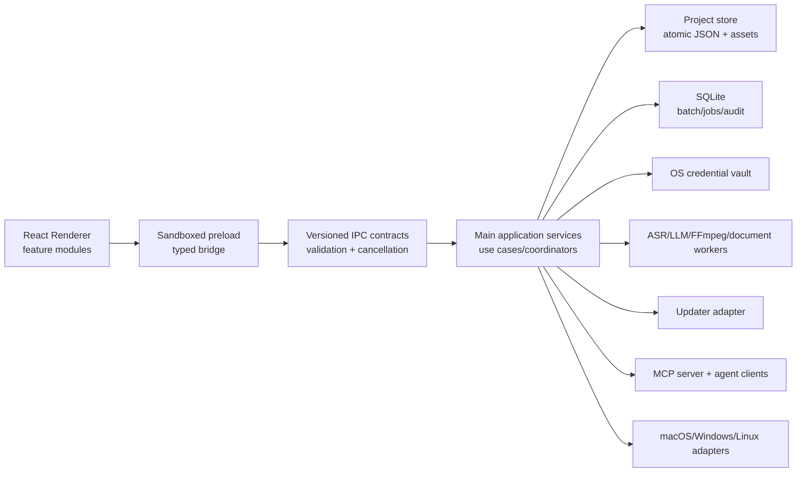
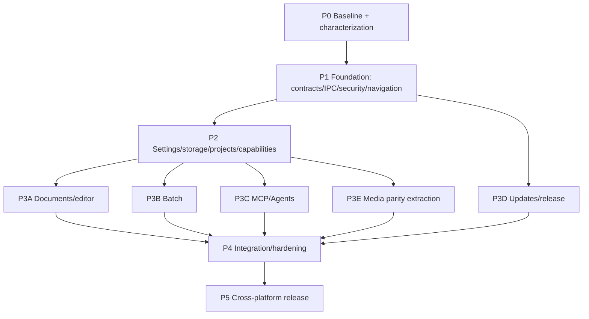

# VaniScript Apple Silicon → VaniScript Electron

## Полный архитектурный план миграции функциональности

> **Статус:** готово к декомпозиции оркестратором и запуску рабочих циклов кодер → ревьюер → тестировщик  
> **Дата аудита:** 21 августа 2026  
> **Канонический baseline:** `Pavan-Gopa/VaniScript@b18ef64ca142938754d3f4ce3832acc6585507da`  
> **Electron baseline:** `Pavan-Gopa/VaniScript-Electron@50ac16e1c463ee4d5d8296cbb5c57eb9e6135b74`  
> **Целевые платформы:** macOS Intel, macOS Apple Silicon, Windows, Linux  
> **Главный принцип:** каноническая Swift-версия определяет продуктовые сценарии, состояния, форматы данных и критерии качества; Electron определяет кроссплатформенные адаптеры и не должен дословно копировать Apple-only реализации.

---

## 1. Результат, который должен дать этот план

После завершения миграции Electron-версия должна стать единым кроссплатформенным продуктом, который:

1. Поддерживает все пользовательские сценарии канонической версии: медиа-проекты, документные проекты, пакетную транскрибацию, редактор, многоязычные переводы, AI Assistant/MCP, Shorts/Visual Editor, проекты, настройки, помощь и обновления.
2. Читает существующие Electron-проекты и импортирует канонические проектные архивы без потери данных.
3. Не скрывает платформенные ограничения: недоступные Apple-only движки отображаются как недоступные с объяснением и предлагаемой заменой, а не молча подменяются другим результатом.
4. Разделяет Renderer, Preload, Main, workers, storage и platform adapters; большие монолиты `src/App.tsx`, `electron/main.js` и `src/components/SettingsModal.tsx` перестают быть местом, куда добавляется вся новая логика.
5. Безопасно хранит ключи, документы и проекты, безопасно обновляется и восстанавливается после падения во время длительной операции.
6. Имеет автоматические parity-тесты, проверяющие общие JSON-контракты и ожидаемое поведение обеих реализаций.

### Не является целью

- Дословный перенос Swift/SwiftUI-кода в TypeScript.
- Эмуляция MLX, Core ML или Metal там, где платформа их не поддерживает.
- Переписывание уже работающих сильных частей Electron — FFmpeg/Hyperframes, llama.cpp, загрузки media URL, текущего media review — без функциональной причины.
- Одновременная поставка одной гигантской PR. Миграция должна идти малыми, проверяемыми рабочими пакетами за feature flags.

---

## 2. Что показал аудит репозиториев

### 2.1. Каноническая версия

Канонический проект уже разделен на три слоя:

- `VaniScriptCore`: модели, state machines, каталоги провайдеров/моделей, документы, batch, MCP, проекты, экспорт и чистая бизнес-логика.
- `VaniScriptRuntime`: очереди, SQLite, watchers, транскрибация и длительные runtime-задачи.
- `VaniScript`: SwiftUI, stores, disk stores, импорт/экспорт, движки, обновления и платформенные сервисы.

Ключевые новые подсистемы после Electron snapshot:

- полнофункциональные document projects и editorial workspace;
- batch transcription 3.1;
- MCP server, Codex/Grok/Qwen assistant и инструменты проекта;
- расширенный каталог cloud providers и usage/budget flows;
- Parakeet/Canary/Core ML local ASR;
- production-grade Sparkle update flow;
- versioned settings/project persistence, migration и safe archive import/export;
- contextual Help Center на английском и русском;
- navigation/performance architecture для больших проектов.

### 2.2. Текущая Electron-версия

Electron уже содержит важные реализации, которые нужно сохранить и оформить как адаптеры:

- импорт аудио/видео/URL и FFmpeg pipeline;
- запись, локальная транскрибация и worker processes;
- локальный перевод через llama.cpp/GGUF;
- Hyperframes render pipeline;
- subtitle alignment/editor и Shorts/Reels;
- project import/export и autosave для media sessions;
- тесты многих чистых функций review/export/glossary/provider/runtime.

Но архитектурно большая часть состояния и side effects сосредоточена в:

- `src/App.tsx`;
- `electron/main.js`;
- `src/components/SettingsModal.tsx`;
- `src/components/subtitle-alignment/SubtitleAlignmentEditor.tsx`.

Настройки хранятся в Renderer `localStorage`, preload открывает широкий неверсированный `window.electronAPI`, `BrowserWindow` запущен с `sandbox: false`, а текущая модель проекта в основном предполагает только media/chunks.

### 2.3. Главный вывод

Миграцию нельзя реализовать как набор новых React-компонентов поверх существующего `App.tsx`. Сначала необходимы общие доменные контракты, хранилище, typed IPC, миграции проектов и четкие process boundaries. Иначе document, batch, MCP и updater создадут взаимозависимый монолит, который будет невозможно надежно тестировать на трех ОС.

---

## 3. Нормативные правила паритета

Для каждой функции оркестратор должен присвоить один из статусов:

- **RETAIN** — Electron уже обеспечивает нужное поведение; код сохраняется, покрывается characterization tests и подключается через новый интерфейс.
- **PORT** — переносится продуктовый контракт и состояние канонической версии.
- **ADAPT** — сценарий одинаков, но backend зависит от ОС/архитектуры.
- **REPLACE** — текущая Electron-реализация нарушает безопасность, надежность или формат данных и заменяется поэтапно.
- **EXPLICITLY UNSUPPORTED** — функция физически недоступна на платформе; UI обязан показать причину и доступную альтернативу.

Обязательные инварианты:

1. Никакого silent fallback между моделями или провайдерами, если это меняет стоимость, приватность или качество.
2. Renderer не является источником истины для проектов, очередей, секретов и обновлений.
3. Любая длительная операция имеет `operationId`, progress, cancel, terminal result и recovery policy.
4. Любой сохраняемый формат имеет `schemaVersion`, валидатор, мигратор и corrupt-backup policy.
5. Любая мутация проекта использует revision/optimistic concurrency; устаревший ответ AI не может перезаписать более свежую правку.
6. Исходный документ и исходный media asset считаются immutable; правки хранятся как проектное состояние/derivatives.
7. API keys, access tokens и manuscript text не попадают в логи, crash reports и updater metadata.
8. Feature считается перенесенной только после unit, integration, E2E и platform packaging gates, а не после появления UI.

---

## 4. Целевая архитектура Electron



### 4.1. Предлагаемая структура каталогов

```text
src/
  app/
    AppShell.tsx
    navigation/
    composition/
    featureFlags/
  domain/
    settings/
    projects/
    media/
    documents/
    batch/
    providers/
    models/
    glossary/
    usage/
    updates/
    mcp/
    shorts/
  application/
    commands/
    queries/
    coordinators/
    stateMachines/
  features/
    upload/
    config/
    processing/
    review/
    export/
    visual-editor/
    document-editor/
    batch/
    assistant/
    settings/
    help/
  stores/
    navigationStore.ts
    workspaceStore.ts
    overlayStore.ts
  components/
    shared/
  lib/
    legacy-adapters/

shared/
  contracts/
    ipc/
    settings/
    projects/
    documents/
    batch/
    updates/
    mcp/
    errors.ts
    events.ts
  schemas/
  test-fixtures/

electron/
  main/
    bootstrap/
    windows/
    security/
    ipc/
    application/
    storage/
    projects/
    documents/
    batch/
    providers/
    models/
    updates/
    mcp/
    media/
    diagnostics/
    platform/
      darwin/
      win32/
      linux/
  preload/
    index.ts
  workers/
    transcription/
    translation/
    document-import/
    document-export/
    ffmpeg/
    batch/
```

### 4.2. Правила process boundaries

**Renderer:** только представление, локальные form drafts, selection/caret, optimistic UI и вызов use cases. Никакого прямого `fs`, shell, credential storage, updater или SQLite.

**Preload:** минимальный versioned bridge. Каждый метод принимает и возвращает схему из `shared/contracts`; каждый event subscription возвращает unsubscribe. Нельзя экспонировать универсальный `invoke(channel, payload)`.

**Main:** владеет файлами, проектами, секретами, update lifecycle, watchers, MCP server, child processes и политиками доступа.

**Workers/child processes:** CPU/GPU/FFmpeg/ASR/LLM/XML/PDF задачи. Worker не пишет проект напрямую; результат коммитит application coordinator после проверки operation/revision.

### 4.3. Typed IPC

Ввести `zod`-схемы либо эквивалентный runtime validator. Контракт каждого запроса:

```ts
type RequestEnvelope<T> = {
  protocolVersion: 1;
  requestId: string;
  projectId?: string;
  expectedRevision?: string;
  payload: T;
};

type ResultEnvelope<T> =
  | { ok: true; requestId: string; value: T; revision?: string }
  | { ok: false; requestId: string; error: AppError };
```

Общие error codes: `VALIDATION_FAILED`, `NOT_FOUND`, `CONFLICT`, `CANCELLED`, `PERMISSION_DENIED`, `CAPABILITY_UNAVAILABLE`, `PROVIDER_ERROR`, `MODEL_UNAVAILABLE`, `SOURCE_CHANGED`, `OUTPUT_COLLISION`, `UPDATE_BLOCKED`, `CORRUPT_DATA`, `INTERNAL`.

Для progress используется `operationId`; события содержат monotonic sequence number. Main игнорирует события от завершенной/отмененной операции. Renderer не должен угадывать terminal state по проценту.

### 4.4. Разбиение монолитов

Разбиение выполняется strangler-подходом:

1. Зафиксировать characterization tests текущего поведения.
2. Выделить pure functions и типы без изменения UI.
3. Ввести facade поверх существующего кода.
4. Перевести одну feature route на facade.
5. Удалить legacy path только после E2E parity.

Нельзя одновременно переписать весь `App.tsx` и добавлять document/batch. Первыми выносятся navigation, project lifecycle, settings, provider registry и long-running operations.

---

## 5. Матрица платформенных возможностей

| Возможность | macOS Apple Silicon | macOS Intel | Windows | Linux | Политика |
|---|---:|---:|---:|---:|---|
| Media project workflow | Да | Да | Да | Да | Общий домен, platform adapters |
| Document project/editor | Да | Да | Да | Да | Общий домен и web editor |
| Batch folders | Да | Да | Да | Да | Общий SQLite scheduler, OS watchers |
| Cloud providers | Да | Да | Да | Да | Main-process HTTP clients |
| llama.cpp/GGUF translation | Да | Да | Да | Да | Существующий Electron backend сохранить |
| Whisper/whisper.cpp ASR | Да | Да | Да | Да | Базовый универсальный local ASR |
| WhisperKit/Core ML | Да | Нет | Нет | Нет | Опциональный adapter, явная недоступность |
| Parakeet/Canary Core ML | Да, при поддержке модели | Нет | Нет | Нет | Не обещать паритет backend; давать cloud/Whisper alternative |
| MLX translation | Да | Нет | Нет | Нет | На Electron основным local backend остается llama.cpp |
| Metal compositor | Возможно | Нет/ограниченно | Нет | Нет | FFmpeg/Hyperframes/WebGPU adapter |
| Microphone capture | Да | Да | Да | Да | OS permissions |
| System audio capture | Да | Да | Да, через WASAPI loopback | Зависит от PipeWire/PulseAudio | Capability probe + setup guidance |
| In-app install update | Да | Да | Да | AppImage — да; deb — notify/manual либо repo | Разные install adapters, единый UX state |
| Code signing | Apple notarization | Apple notarization | Authenticode | checksums/signatures | Release gate |

`CapabilityRegistry` должен возвращать не только `boolean`, а объект `{ available, reasonCode, userMessage, remediation, backend }`. Настройки и workflow selectors обязаны использовать этот registry.

---

## 6. Хранилища и форматы данных

### 6.1. Предлагаемый layout

```text
app.getPath('userData')/
  settings/settings.json
  settings/migration-receipts.json
  projects/<project-id>/
    project.json
    assets/
    data/
    working/
    output/
    recovery/
  batch/batch.sqlite
  batch/output-receipts/
  models/asr/
  models/translation/
  cache/
  logs/
  diagnostics/
  updates/receipts.json
```

Секреты не лежат в `settings.json`; там хранятся только opaque secret references. Реальные ключи помещаются в macOS Keychain, Windows Credential Manager и Secret Service/libsecret. Если системный vault недоступен, приложение должно запросить явное согласие на encrypted fallback и не хранить plaintext по умолчанию.

### 6.2. Settings store

Реализовать actor-like serialized service в Main:

- explicit decoder с defaults для каждого поля;
- atomic write `temp → fsync → rename`;
- backup поврежденного файла в `Corrupt/`;
- debounced save и обязательный `flush()` при quit/update;
- migration receipts;
- redacted diagnostics export;
- reset только после подтверждения, с возможностью сохранить glossary/prompts/models.

### 6.3. Project store

Проект сохраняется атомарно и имеет:

- `schemaVersion`;
- `projectId`, `sourceKind`, timestamps, active route;
- monotonically increasing `revision`;
- asset manifest с role, relative path, size, checksum;
- domain state: `mediaState` или `documentState`;
- output metadata и recovery journal.

Сначала Electron должен **читать и писать канонический schema v3** и читать собственный legacy media format. Нельзя самостоятельно выпускать schema v4. Новый общий schema v4 допускается только после отдельного ADR в обоих репозиториях, shared fixtures и dual-reader периода.

### 6.4. Project archive

Импорт выполняется через staging directory:

1. Проверка расширения, размера и manifest.
2. Защита от zip-slip, symlink escape, абсолютных путей и case-collision.
3. Проверка checksum каждого entry.
4. Валидация JSON schema и invariants.
5. Разрешение collision project ID: replace запрещен по умолчанию; предлагается import as copy.
6. Atomic move staging → projects.

Экспорт всегда строит новый manifest и checksums. Частично созданный архив удаляется при ошибке.

### 6.5. Cross-repo contract fixtures

Создать каталог `shared/test-fixtures/parity/` с обезличенными fixtures:

- settings legacy/current;
- media project v1/v2/v3;
- document project v3 с несколькими языками;
- project archive manifest;
- batch job/checkpoint;
- MCP tool request/result;
- update descriptor/receipt.

Обе кодовые базы должны прогонять fixtures. Это основной механизм предотвращения дальнейшего расхождения.

---

## 7. Настройки: полный перенос

### 7.1. Новая навигация Settings

Канонические разделы:

1. **Agents**
2. **API & Usage**
3. **Appearance**
4. **Chunking**
5. **Glossary**
6. **Models**
7. **Prompts**
8. **Transcription**
9. **Updates**

Текущую Electron-вкладку **Statistics** нельзя потерять. Ее следует перенести как вложенный экран/панель в `API & Usage` и сохранить alias старого route на время миграции.

### 7.2. Миграция `localStorage`

Текущие `vs_settings_v1` и `vs_usage_v1` мигрируются один раз:

1. Main сообщает Renderer, что legacy migration требуется.
2. Renderer читает только известные legacy keys, парсит JSON и отправляет payload через специализированный IPC.
3. Main валидирует каждое поле, нормализует legacy model/provider IDs и отделяет секреты.
4. Main сохраняет `settings.json`, vault secrets и migration receipt.
5. Main повторно читает данные и возвращает checksum/summary.
6. Только после подтвержденного commit Renderer удаляет legacy keys.
7. При сбое legacy данные остаются, миграция безопасно повторяется.

### 7.3. Поля и поведение по разделам

#### Agents

- Local MCP server enabled/disabled.
- Bind только loopback; отображение порта/status.
- Access token: generate/rotate/copy/revoke.
- Permission toggles для read, mutate, processing, file, network и destructive tools.
- Preferred agent: Codex, Grok, Qwen.
- Agent profiles и per-agent model/reasoning settings.
- Embedded Codex/Grok/Qwen chat enablement и credentials.
- Test connection, last error, last successful connection.
- Audit log shortcut.

#### API & Usage

Единый provider catalog, а не hardcoded cards:

- Google Gemini: key bank до 10 ключей, enable/disable, rotation, model selection, budget.
- OpenAI: key, text model, transcription model, budget.
- Anthropic: key, model, translation capability; не показывать как ASR.
- Qwen/DashScope: key, model, base URL/profile, budget.
- OpenRouter: key, text model, transcription model, translation model, budget, real credits where supported.
- Ollama Cloud: key, model, base URL, plan/limits.
- Custom OpenAI-compatible providers: name, base URL, headers/auth reference, per-purpose models, budget.
- Fetch models, refresh cache, manual model ID fallback.
- Key validation без логирования ключа.
- Capability badges: transcription, translation, vision, balance.
- Favorite models и отдельный model choice по purpose.
- Usage: input/output tokens, audio minutes, requests, last model, last purpose, estimated cost, real balance where API supports it.
- Budget gate должен блокировать новый запрос до отправки в сеть и объяснять, как изменить лимит.

#### Appearance

- Сохранить текущие Electron theme/font controls.
- Синхронизировать theme, font family, base size, scale, annotation mode и density tokens.
- Отдельные настройки editor fonts: source, translation, monospace/verse.
- Reduce motion и high contrast.
- Preview без немедленной необратимой записи; Apply/Cancel либо draft state.

#### Chunking

- Target duration 1–60 минут.
- Slice mode.
- Silence threshold.
- Minimum silence duration.
- Smart/semantic strategy flags.
- Разделить media chunking и document semantic chunking; значения одного не должны случайно влиять на другое.
- Batch job всегда хранит snapshot effective config, чтобы изменение настроек не меняло уже поставленную очередь.

#### Glossary

- Language-scoped glossary.
- Add/edit/delete, search, sort, filter.
- Project glossary поверх global glossary.
- Protected terms и replacement policy.
- Import/export JSON backup с schema/version.
- Merge preview при импорте: add/update/conflict/skip.
- Действие «сохранить замену в glossary» из editor/review.
- Undo для массовых операций.

#### Models

- Общий ModelCatalog с backend, architecture, capabilities, size, hashes и platform requirements.
- Local ASR и local translation отдельно.
- Download/pause/resume/cancel, partial files, free-space check, checksum verification.
- Scan/reconcile existing models.
- Locate external model и безопасный reference/import policy.
- Move storage root с transactional copy.
- Per-model diagnostics и benchmark smoke test.
- Явный статус `unavailable_on_platform` для MLX/Core ML моделей на Intel/Windows/Linux.

#### Prompts

- Versioned built-in defaults, user copies и project overrides.
- Presets для translation, literary translation, proofreading, repair, shorts planning и agents.
- Duplicate/rename/reset/export/import.
- Показывать variables/constraints и валидировать обязательные placeholders.
- Не изменять built-in preset in-place; обновление приложения может добавить новую версию, но не стирать user copy.

#### Transcription

- Default source language.
- Default transcription provider/model.
- Default translation provider/target language.
- Per-purpose provider capability filtering.
- Voice isolation/normalization options, если backend доступен.
- Language auto-detection policy.
- Document approval mode default.
- Batch defaults отдельно от interactive workflow.

#### Updates

Подробно описано в разделе 11.

### 7.4. Acceptance criteria Settings

- Перезапуск сохраняет все nonsecret поля и секретные references.
- Legacy install переносится без потери ключей, glossary, prompts, usage и model state.
- Поврежденный JSON не блокирует запуск; создается backup и понятное уведомление.
- UI никогда не получает plaintext всех сохраненных ключей; только masked metadata и одноразовые операции set/delete/test.
- Выбор недоступного provider/model невозможен после capability validation.
- Все settings migrations покрыты golden tests.

---

## 8. Provider и model architecture

### 8.1. Единые каталоги

Перенести концепции `CloudProviderCatalog`, `CloudModelCatalog`, `ProviderRegistry` и `NativeModelCatalog` как pure TypeScript domain modules. UI и engines не должны иметь собственные списки провайдеров.

Provider descriptor содержит:

- stable ID;
- display label;
- auth type;
- model-list endpoint strategy;
- capabilities;
- default models по purpose;
- balance strategy;
- pricing metadata version;
- endpoint policy и allowed hosts.

### 8.2. Routing

`ProviderRouter.resolve({ providerId, purpose, modelId, settings, platformCapabilities })` возвращает готовый route либо typed error. Routing проверяет:

- key/credential presence;
- budget;
- model capability;
- endpoint validity;
- purpose compatibility;
- network permission;
- cancellation/timeout policy.

Cloud requests выполняются в Main/worker, а не в Renderer. В event/log payload нельзя включать Authorization headers или полный response body с пользовательским текстом.

### 8.3. Local models

Сохранить Electron llama.cpp как основной universal local translation backend. Добавить abstraction:

- `LocalTranslationEngine`;
- `LocalAsrEngine`;
- `ModelInstaller`;
- `ModelVerifier`;
- `ModelPresenceReconciler`.

Apple Silicon adapters могут добавлять Core ML/MLX, но проекты сохраняют logical model ID + backend metadata. При открытии на другой платформе UI предлагает совместимый backend; он не запускается автоматически без согласия.

### 8.4. Provider parity tests

Для каждого provider тестировать:

- пустой/неверный key;
- model discovery и stale cache;
- unsupported purpose;
- budget reached;
- timeout/rate limit/server error;
- cancellation;
- usage recording;
- redaction.

---

## 9. Проекты и универсальный workflow

### 9.1. Унифицированная модель

Проект должен иметь discriminated union:

```ts
type ProjectState = {
  schemaVersion: 3;
  projectId: string;
  revision: string;
  sourceKind: 'media' | 'document';
  route: UniversalWorkflowScreen;
  mediaState?: MediaProjectState;
  documentState?: DocumentState;
  metadata: ProjectMetadata;
  activeTranslationLanguage?: string;
  createdAt: string;
  updatedAt: string;
};
```

`mediaState` и `documentState` взаимоисключающие. Batch jobs не маскируются под обычный проект; batch — отдельный runtime/workspace, но может позже создавать project snapshot только явной командой пользователя.

### 9.2. Workflow screens

Сохранить общий shell:

- Upload
- Config
- Processing
- Review
- Export
- Visual Editor

Но route projection зависит от `sourceKind`. Document project не должен монтировать video preview/FFmpeg/subtitle tree, а media project — document editor/package parser.

### 9.3. Autosave и revision

- Main владеет project revision.
- Renderer отправляет command с `expectedRevision`.
- При конфликте возвращается `CONFLICT`, UI делает reload/merge, а не overwrite.
- Text editing использует debounced operation batches, но flush выполняется при route change, project close, quit и update install.
- Recovery journal позволяет восстановить последние несохраненные editor transactions после crash.

### 9.4. Source refresh

Для document source refresh:

- повторный import в staging;
- matching стабильных block IDs/signatures;
- отчет matched/added/removed/changed;
- сохранение переводов для неизмененных блоков;
- stale status для измененных;
- явное предложение retranslate changed chunks;
- никогда не удалять старую translation archive без backup.

Для media relink/refresh:

- checksum/size/mtime verification;
- явный relink missing source;
- пересчет derived audio только при необходимости;
- предупреждение, если тайминг или продолжительность изменились.

---

## 10. Режим для редакторов: document projects

Это отдельная полноценная feature lane, а не импорт текста в существующий transcript textarea.

### 10.1. UX и маршруты

На Upload пользователь выбирает:

- Audio/Video;
- Record Audio;
- Import Link;
- **Import Document**.

После document import:

1. Preflight показывает format, pages/words/sections, warnings, protected content и extraction accuracy.
2. Config задает source language, один или несколько target languages, translation profile, provider/model, glossary и approval mode.
3. Processing строит semantic chunks и выполняет перевод.
4. Review открывает editorial workspace.
5. Export создает DOCX/TXT/Markdown/PDF и project bundle.

### 10.2. Поддерживаемые форматы

В первом parity release:

- Input: DOCX, PDF с текстовым слоем, RTF, TXT, Markdown.
- Output: DOCX, TXT, Markdown, PDF.

Лимиты должны соответствовать каноническим ограничениям либо быть строже с явным сообщением: DOCX до 64 MB, PDF до 100 MB/2000 страниц, RTF/TXT/Markdown до 32 MB. Scanned PDF без text layer отклоняется как `OCR_REQUIRED`; OCR не включать молча.

### 10.3. Import pipeline

Импорт выполняется worker-ом:

1. Копирование immutable source в project assets через staging.
2. Hash/size capture.
3. Safe parser с лимитами вложенности/архива.
4. Нормализация в структурные blocks/spans.
5. Формирование preflight report.
6. Atomic commit `DocumentState`.

DOCX: хранить оригинальный OOXML package и stable mapping к разрешенным text nodes. Нельзя ограничиться HTML-конвертацией через библиотеку, теряющую headers, footers, notes, text boxes и styles.

PDF: извлекать текст и layout metadata в worker; страницы без достаточного текста отмечать warning/error. PDF не обещает round-trip fidelity исходного макета.

### 10.4. Document domain model

Нужно перенести следующие понятия:

- parts: main body, header, footer, footnote, endnote, text box;
- blocks: paragraph, heading, quote, verse, list, table, row, empty, other;
- stable `blockId`, location, style fingerprint, source hash;
- spans и inline traits: bold, italic, underline, strike, super/subscript, small caps, colors;
- translation/protection policy на block/span;
- immutable original asset reference;
- preflight metadata/warnings;
- semantic chunk plans с context before/after, token estimate и block slices;
- translations archive keyed by normalized BCP-47 language;
- freshness/review/approval status.

### 10.5. Многоязычный перевод

- Один project хранит несколько target languages.
- Active language — только view state; переключение не перетирает другие варианты.
- Добавление языка создает новый translation archive.
- Удаление требует подтверждения и optional export/backup.
- Каждая language variant хранит provider/model/profile/prompt version/glossary revision/source hash.
- Export выбирает один язык или пакет языков.
- Project sidebar и review показывают прогресс по каждому языку.

### 10.6. Translation coordinator

Поддержать intents:

- automatic batch;
- manual current chunk;
- targeted current/selection.

State machine: `idle → preparing → translating → validating → repairing → committing → paused/completed/failed/cancelled`.

Требования:

- pause/resume/cancel;
- progress по chunks/blocks/tokens;
- rolling context/memory;
- local structural validation;
- не более двух repair attempts для repairable response;
- automatic mode auto-approves только валидные результаты;
- подозрительные результаты получают `Needs Review`;
- failed targeted translation сохраняет прежний валидный вариант;
- commit после каждого успешно обработанного chunk;
- stale operation не может перезаписать новый source/target revision.

### 10.7. Editorial workspace

Рекомендуемый web editor: ProseMirror с собственной schema и transaction metadata; Tiptap допустим только как UI wrapper, если не скрывает stable IDs и transactions. Обычный `contentEditable` без структурной модели неприемлем.

Workspace включает:

- side-by-side Source / Translation;
- Source / Translation / Dual modes;
- language tabs;
- chunk/block navigator;
- caret/selection, copy/paste, undo/redo;
- formatting сохраненных traits;
- find/replace current document/current language/all selected scopes;
- protected spans;
- `Needs Review`, approved, stale markers;
- comments/translator notes;
- proofreading highlights;
- selection retranslation;
- glossary action;
- keyboard shortcuts и accessible focus order.

Инварианты editor:

1. `DocumentState` — источник истины, ProseMirror view — projection.
2. Неизмененные span IDs сохраняются.
3. AI возвращает текст, но не определяет trusted IDs/styles/permissions.
4. Source edit помечает зависимый перевод stale, но не удаляет его.
5. Programmatic replace/retranslate — одна атомарная undo step.
6. Clipboard удаляет private internal IDs.
7. Ответ selection AI применяется только при совпадении source selection hash и target revision.
8. Ни один full document snapshot не пишется в обычный application log.

### 10.8. Find/replace и selection translation

Selection snapshot содержит operation ID, language, chunk, block fragments, source hashes и target revision. После ответа:

- проверить, что selection еще существует;
- проверить expected revision;
- применить только разрешенные text mutations;
- сохранить surrounding formatting;
- вернуть точный changed range;
- позволить undo одним действием.

Replace Everywhere сначала показывает preview count. Массовая замена работает transactionally; при ошибке никакая часть не коммитится.

### 10.9. Proofreading и source freshness

Перенести alignment/highlight логику:

- source/translation sentence or block correspondence;
- highlights при navigation и search;
- stale/freshness calculation по hashes;
- review filters: All, Needs Review, Stale, Approved;
- source refresh merge report.

### 10.10. Export

- DOCX round-trip: патчить сохраненный package, сохраняя неподдерживаемые части и стили.
- TXT/Markdown: deterministic formatter.
- PDF: печать/рендер из нормализованной document projection; metadata и page setup.
- Export validation: нет незакрытых structural errors; предупреждение о stale/Needs Review.
- Atomic write и cleanup partial output.
- Golden round-trip fixtures обязательны для headers/footers/notes/tables/lists/verse/formatting.

### 10.11. Acceptance criteria Document mode

- Импорт всех пяти форматов не блокирует Renderer.
- Save/reopen сохраняет structure, edits, languages, approval и undo recovery boundary.
- DOCX import → edits → export сохраняет проверяемые стили и нетронутые package parts.
- Добавление второго языка не меняет первый.
- Source edit делает только затронутые translations stale.
- Selection translation не применяет устаревший ответ.
- Project archive round-trip проходит checksum и parity fixtures.

---

## 11. Batch mode

Batch — отдельный workspace и отдельная кнопка, а не скрытый вариант Upload.

### 11.1. Навигация

Добавить глобальный переключатель/rail:

- **Projects**
- **Batch**

Batch button всегда доступна из главного окна, показывает badge `running/paused/failed`. Переход не уничтожает состояние текущего проекта. Batch workspace не создает обычный project автоматически.

### 11.2. UI

- Add Folder и drag-and-drop folders.
- Профили folders: display path, enabled, recursive, config summary.
- Queue controls: Scan, Start, Pause after current, Resume, Stop after current.
- Job rows: state, progress, phase, attempts, source/output, last error.
- Job details: fingerprint, config snapshot, checkpoints, timestamps, logs, retry/cancel.
- Filters: all/pending/running/completed/failed/collision/cancelled.
- Глобальные issues: model unavailable, permission lost, watcher error, disk full.
- Никакого auto-start после upgrade или первого добавления folder.

### 11.3. Domain models

Перенести:

- folder profile с stable ID, path access token/bookmark equivalent, enabled, recursive;
- immutable config snapshot;
- phases: planning, loadingModel, convertingAudio, transcribing, finalizing;
- states: pending, processing, completed, failed, cancelled, blockedOutputCollision;
- source fingerprint: size, mtime, SHA-256;
- generation, attempt, progress, checkpoint, output fingerprint;
- max attempts default 3;
- drain/pause/cancel semantics.

### 11.4. SQLite schema

Минимальные таблицы:

- `schema_migrations`;
- `folder_profiles`;
- `batch_jobs`;
- `job_checkpoints`;
- `job_events`;
- `output_receipts`;
- `watcher_generations`.

Использовать WAL, busy timeout, transactions и prepared statements. UI получает query projections, а не всю event history.

### 11.5. Watchers и file stability

Adapter per OS поверх `chokidar`/native watcher:

- initial reconciliation scan;
- recursive policy;
- debounce duplicate events;
- generation ID, чтобы события старого watcher игнорировались;
- file stability probe: несколько неизменных size/mtime samples;
- ignore partial/temp/hidden/output files;
- periodic reconciliation на случай lost events;
- permission-loss detection.

macOS bookmark, Windows path/ACL и Linux portal/path handling должны быть отдельными adapters. Сохранять только canonical real path/opaque access reference; не доверять path из Renderer.

### 11.6. Scheduler

Первый parity release использует один активный transcription job, чтобы избежать memory/model contention. Архитектура допускает configurable concurrency позже.

- Queue claim в SQLite transaction.
- Worker heartbeat/checkpoint.
- Crash recovery переводит interrupted processing в pending/retryable либо failed по policy.
- Config change: текущий job заканчивается, очередь drain, затем watcher/scheduler перезапускаются с новой generation.
- Model/provider readiness проверяется до старта.
- Cancel завершает child process, удаляет partial derivatives и фиксирует terminal state.

### 11.7. Безопасный output

Parity output: companion `.txt` рядом с source.

- Output path обязан иметь тот же parent/stem и `.txt`.
- Запрещены absolute/`..`/backslash tricks и выход через symlink.
- Case-insensitive collision проверяется даже на case-sensitive FS для переносимости.
- Existing file заменяется только если его fingerprint совпадает с ранее созданным VaniScript output receipt.
- Внешне измененный output блокирует job как `blockedOutputCollision`.
- Запись: temp file в том же каталоге → fsync → atomic rename.
- Source fingerprint перепроверяется перед final commit.

### 11.8. Переиспользование движков

Batch coordinator вызывает общий `FileTranscriptionService`, а не копирует interactive pipeline. Общими должны быть:

- media probe/normalization;
- provider/model router;
- ASR worker;
- timed text/plain text formatter;
- cancellation;
- usage recording.

Batch-specific остаются watcher, queue, retry, checkpoint и companion writer.

### 11.9. Acceptance criteria Batch

- 10 000 discovered files не блокируют Renderer; rows виртуализированы.
- Дубликаты watcher events не создают duplicate jobs.
- Crash/restart продолжает очередь без повторной перезаписи completed outputs.
- Измененный source создает новую generation/job, а не подменяет старую запись.
- Измененный пользователем `.txt` никогда не перезаписывается.
- Pause after current и stop after current имеют детерминированное поведение.
- Path/symlink/case collision suite проходит на macOS, Windows и Linux.

---

## 12. Встроенная система обновлений

### 12.1. Общая семантика

Electron должен повторить канонический UX/state contract, но использовать Electron updater adapter, а не Sparkle.

State machine:

- `idle`
- `checking`
- `upToDate`
- `available`
- `downloading`
- `verifying`
- `readyToInstall`
- `installing`
- `failed`

Descriptor: version, build, title, notes, critical/informational, publish date, size, info URL, platform/arch, channel.

### 12.2. Пользовательский контроль

- Automatic background checks разрешены по настройке.
- Автоматическая загрузка/установка по умолчанию запрещена.
- Download и Install запускаются явным действием.
- Skip version, remind later, retry, cancel download.
- Critical update меняет presentation, но не обходит readiness/save.

### 12.3. Update readiness

Перед install Main собирает blockers:

- microphone/system recording;
- recording preview/save;
- media segment processing;
- transcript/document/shorts translation;
- shorts render/planning;
- batch current job;
- document autosave/unsaved recovery journal;
- project save failure;
- model download/relocation, если прерывание небезопасно.

UI показывает список причин. После их исчезновения пользователь снова нажимает Install. `prepareForUpdateTermination()` синхронно/с bounded timeout flush-ит settings, projects, SQLite и recovery state.

### 12.4. Технология и platform adapters

Использовать `electron-updater`/electron-builder metadata либо эквивалент, завернутый в собственный `UpdateService`.

- macOS: Developer ID signing, hardened runtime, notarization, stapling; для auto-update публиковать подходящий ZIP metadata вместе с DMG.
- Windows: Authenticode signed NSIS, blockmap/yml, корректный per-user/per-machine policy.
- Linux AppImage: встроенная загрузка/установка при поддерживаемом format.
- Linux deb: уведомление и безопасный переход к signed download/package repository; не притворяться, что deb можно заменить как AppImage.

Electron repo приватный, поэтому production client не должен содержать GitHub token. Update assets/feed размещаются в публичном artifact bucket/release repository или за специально спроектированным authenticated endpoint.

### 12.5. Проверка и receipts

- Проверка signature/metadata до install.
- Channel/platform/arch match.
- Version monotonicity и downgrade protection.
- Update receipt: from/to version, channel, timestamp, artifact hash, result.
- На следующем запуске health marker подтверждает успешный launch.
- При launch failure приложение предлагает безопасную инструкцию/previous installer; автоматический rollback возможен только после отдельного проверенного дизайна.

### 12.6. Release workflow

GitHub Actions matrix:

1. Validate SemVer/build monotonicity.
2. Typecheck, lint, unit/integration/E2E.
3. Build отдельно на macOS Intel target, Windows и Linux; macOS arm64 по поддерживаемой матрице.
4. Verify bundled FFmpeg, llama runtime, yt-dlp и native modules.
5. Sign/notarize.
6. Generate checksums, SBOM и provenance.
7. Smoke-install на clean runners/VM.
8. Generate update metadata и release notes.
9. Upload artifacts.
10. Upload feed/latest metadata **последним**, после всех artifacts.
11. Staged channel: internal → beta → stable.

### 12.7. Acceptance criteria Updates

- Check/download/cancel/retry/install state survives expected app lifecycle.
- Install блокируется во время активных операций и после save failure.
- Tampered artifact/feed отклоняется.
- Нет auto-install без действия пользователя.
- Clean upgrade сохраняет settings, secrets, projects, models, batch queue и recovery data.
- Failure-injection tests покрывают network loss, disk full, signature error, quit race и corrupt metadata.

---

## 13. MCP, Agents и AI Assistant

### 13.1. MCP server

Реализовать в Main отдельный server/service:

- bind только `127.0.0.1`/`::1`;
- token authentication;
- protocol/version negotiation;
- start/stop/restart status;
- request size, timeout и concurrency limits;
- audit record без пользовательского текста по умолчанию;
- project revision в read/mutate responses.

### 13.2. Risk scopes

Tools группируются:

- read-only project/transcript/document/help;
- mutation;
- processing/retranslation/reprocess;
- file import/export;
- network;
- destructive.

Settings определяют разрешенные scopes. Mutating/destructive tools требуют confirmation policy. Любая мутация проверяет expected project revision; stale agent action возвращает conflict.

### 13.3. Tool families

Перенести/сверить полный canonical catalog:

- project state/navigation/summary;
- transcript/chunk/cue read and edit;
- timing/alignment/reprocess;
- glossary read/write;
- document selection/edit/translate/proofread;
- export jobs;
- Shorts plan/translation/render controls;
- processing job status/cancel;
- contextual help/search;
- screenshots/selected content where user explicitly sends it.

Каждый tool имеет JSON schema, risk level, capability requirements, confirmation text и deterministic result envelope.

### 13.4. Embedded agents

Assistant sidebar поддерживает:

- MCP route и explicit API route;
- Codex, Grok, Qwen profiles;
- model/reasoning selector;
- streaming tokens;
- running tool indicator;
- cancel;
- copy/retry;
- dictation через selected local ASR;
- «Send to Assistant» из transcript/document/shorts/editor;
- user-selected screenshot/attachment с явным preview.

Conversation state не должен бесконтрольно раздувать project JSON. Хранить bounded history отдельно либо по opt-in в project data.

### 13.5. Security

- Agent не получает arbitrary filesystem path.
- File tool работает с opaque handles/project-relative paths.
- Network tools используют allowlist/policy.
- Shell execution отсутствует, если не введен отдельный audited capability.
- Prompt/tool logs редактируют secrets и manuscript content.
- Confirmation cannot be auto-accepted агентом.

### 13.6. Acceptance criteria MCP

- Server недоступен извне loopback.
- Invalid/expired token отклоняется.
- Permission matrix покрыта table-driven tests.
- Mutating tool не применяет stale revision.
- Cancel останавливает streaming и child work.
- Audit дает достаточную диагностику без утечки текста/ключей.

---

## 14. Media workflow: сохранить сильные стороны Electron и закрыть дельту

### 14.1. Upload/import/recording

**RETAIN/ADAPT:** текущие file import, URL import, FFmpeg probe, yt-dlp и recording backends.

Доработать:

- общий `SourceDescriptor` и immutable asset copy/reference policy;
- platform permissions и capability messages;
- source fingerprint/relink;
- cancellation и cleanup temp files;
- separate microphone/system recording flows;
- safe URL validation, download limits и metadata normalization;
- video-book/long media сценарии из parity map.

### 14.2. Config

- metadata;
- source/target language;
- capability-filtered transcription/translation providers;
- local/cloud model readiness;
- chunking/slicing;
- output formats;
- effective config snapshot в project.

`Initialize Engine` не должен запускать тяжелую работу, пока readiness validator не вернет полный список ошибок/исправлений.

### 14.3. Processing

- Выделить `MediaProcessingCoordinator` из `App.tsx`.
- State machine с resume/cancel/retry.
- Chunk planner, audio conversion, ASR, translation, validation и persistence — отдельные stages.
- Checkpoint после каждого chunk.
- Usage recording на фактически завершенный provider call.
- Worker crash изолирован от Main/Renderer.

### 14.4. Review

Сохранить текущие сильные review/editor функции и синхронизировать канонические сценарии:

- source/translation/dual views;
- multi-language translation archive;
- approve & next и contiguous progress;
- reprocess/retranslate current;
- cue editing, timing, alignment;
- text revisions и glossary actions;
- hotkeys;
- source refresh/stale markers;
- send selection/chunk to Assistant;
- deterministic autosave.

### 14.5. Export

- TXT, Markdown, SRT, VTT и другие текущие форматы;
- deterministic naming/canonical names option;
- project bundle;
- export selected language/all languages;
- atomic output;
- collision dialog;
- validation of stale/unapproved segments.

### 14.6. Shorts/Reels и Visual Editor

Сохранить Hyperframes/FFmpeg и текущий visual editor, затем перенести недостающие canonical contracts:

- transcript moment extraction/planning;
- selected source language и translation variants;
- idea export;
- framing/crop/timing/cuts;
- subtitle styling/alignment;
- background, logo, text and audio tracks;
- preview/render parity;
- operation progress/cancel;
- editor state persistence в project;
- platform capability/fallback вместо Metal-only assumptions.

Рендер должен получать immutable render plan и писать output атомарно. Renderer UI не конструирует shell command.

---

## 15. Help, onboarding, glossary, usage и diagnostics

### 15.1. Help Center

Перенести data-driven `VaniScriptHelpCatalog`:

- English/Russian;
- categories;
- search ranking;
- requirements, steps, troubleshooting, related topics;
- contextual help по active screen/state;
- first-project checklist.

Help content хранится как versioned data, не размазывается по JSX.

### 15.2. Onboarding

- Version/build-aware completion marker.
- Отдельные tours для media, document, batch и assistant.
- Resume/restart tour.
- Не показывать автоматически каждый update; только при изменении onboarding content version.
- Accessibility: keyboard navigation, focus trap, screen reader labels.

### 15.3. Usage/statistics

- Provider/model/purpose granularity.
- Tokens, audio minutes, requests, errors, estimated spend.
- Real balance отдельно от estimate.
- Date range/reset/export.
- Usage update transactionally рядом с completed request.
- Никакого текста запросов.

### 15.4. Logging/diagnostics

- Structured log levels.
- Rotating files и retention.
- Correlation IDs: request/project/operation/job.
- Redaction middleware.
- Diagnostics bundle: app/platform versions, capability report, model manifests, redacted settings, recent errors; без keys и manuscript text.
- UI для открытия logs и копирования safe diagnostic summary.

---

## 16. Navigation, производительность и доступность

### 16.1. Navigation state

Разделить:

- selected project;
- workspace route;
- global mode Projects/Batch;
- overlays/modals;
- pane layout;
- active assistant/sidebar.

Route монтирует только нужный feature tree. Нельзя держать одновременно скрытые document editor, video editor, batch list и processing workspace.

### 16.2. Performance rules

- Virtualize project/chunk/batch/document lists.
- Normalize entities по stable IDs.
- Memoized selectors и bounded projections.
- Большие документы не копировать целиком при каждом keystroke.
- Heavy parsing/hash/FFmpeg/ASR/LLM вне Renderer.
- Route change отменяет ненужные queries/tasks, но не ломает background jobs.
- Blob/media preview не держать бесконтрольно в памяти.

### 16.3. Performance gates

Тестовые наборы:

- 500 media chunks;
- document 100 000+ words/10 000 blocks;
- 10 000 batch jobs;
- 100 projects;
- long-running assistant stream.

Зафиксировать budgets для route switch, typing latency, scroll, initial projection и memory. Конкретные цифры утверждаются после baseline profiling, но regression threshold должен стать CI artifact.

### 16.4. Accessibility

- Полная keyboard navigation.
- Visible focus.
- Semantic labels/status announcements.
- Reduced motion/high contrast.
- Captions и нецветовые indicators.
- Editor screen-reader strategy и shortcut reference.

---

## 17. Security и privacy hardening

Обязательные изменения:

1. `sandbox: true`, `contextIsolation: true`, `nodeIntegration: false`.
2. Strict CSP; запрет arbitrary navigation и `window.open`.
3. Permission request handler для media/device permissions.
4. Typed allowlisted IPC; sender/frame validation.
5. Main-side path validation и opaque handles.
6. Secrets в OS vault.
7. Safe archive/XML/PDF parsing с quotas.
8. Symlink/path traversal defenses.
9. Network endpoint validation/allowlist для provider/custom/MCP tools.
10. No shell interpolation; `spawn` с argument arrays.
11. Signed updater artifacts.
12. Redacted logs/crash diagnostics.
13. Dependency/native binary inventory, SBOM и vulnerability scanning.
14. Safe temp permissions и cleanup.
15. No remote content with Node privileges.

Переход к sandbox делается до MCP/document release. Несовместимые preload/native flows выносятся в Main, а не используются как причина оставить sandbox выключенным.

---

## 18. Стратегия тестирования

### 18.1. Unit

Pure domain tests:

- settings decode/migrations;
- provider capability/routing/budget;
- project migrators/invariants;
- document mutation/freshness/validation/export planning;
- batch state machine/path/output policy;
- update state/readiness;
- MCP permission/risk/revision;
- naming/timing/alignment/shorts plans.

### 18.2. Main integration

- atomic stores и corrupt recovery;
- credential adapter mocks;
- SQLite/restart/crash recovery;
- worker lifecycle/cancellation;
- IPC validation;
- archive import/export;
- updater fake server;
- MCP loopback server.

### 18.3. Renderer/component

- settings drafts/errors;
- document editor transactions/undo;
- batch filters/actions;
- update status/blockers;
- assistant streaming/tool confirmation;
- capability-disabled controls.

### 18.4. Electron E2E

Использовать Playwright Electron launcher либо эквивалент:

- first launch + legacy migration;
- create/reopen/export media project;
- import/edit/translate/export document project;
- add folder/run/pause/restart batch;
- MCP read/mutate confirmation;
- updater check/download readiness;
- crash/restart recovery.

### 18.5. Golden/fixture tests

- DOCX/RTF/PDF import.
- DOCX round-trip.
- SRT/VTT/timed text.
- Project bundles/checksums.
- Cross-edition JSON fixtures.
- Path behavior on case-sensitive/case-insensitive filesystems.

### 18.6. Packaging smoke tests

На clean VM/runner каждой ОС:

- install/uninstall;
- launch without dev dependencies;
- packaged FFmpeg/llama/yt-dlp presence;
- native module ABI;
- model download/scan;
- file dialogs/permissions;
- update from previous stable;
- user data preservation.

---

## 19. План выполнения и зависимости



### P0 — Baseline и characterization

- Зафиксировать source SHAs этого документа.
- Создать parity fixture package.
- Добавить smoke E2E текущих Electron media flows.
- Снять performance/memory baseline.
- Составить machine-readable parity register.
- Запретить рост `App.tsx`/`main.js` lint rule или review policy.

**Gate:** текущий продукт воспроизводимо собирается и smoke-тестируется на трех ОС.

### P1 — Foundation

- Shared contracts/errors/events.
- Typed preload/IPC facade.
- Main bootstrap/module split.
- Sandboxed BrowserWindow и security policy.
- Navigation/overlay/pane stores.
- Operation registry/cancellation.
- Feature flags.

**Gate:** старые media flows проходят через новый bridge либо legacy adapter; sandbox включен.

### P2 — State/data/platform foundation

- Main settings store + vault + localStorage migration.
- Project store/migrator/archive v3.
- Capability registry.
- Provider/model catalogs и routing.
- Logging/diagnostics.
- Help/onboarding data layer.

**Gate:** restart, migration и archive tests; Settings больше не зависит от localStorage как source of truth.

### P3A — Document lane

- Import/normalized model/preflight.
- Project persistence.
- Semantic chunk/translation coordinator.
- Multi-language archives.
- ProseMirror editor/mutations/undo.
- Selection AI/find-replace/proofreading/freshness.
- DOCX/TXT/MD/PDF export.

### P3B — Batch lane

- SQLite/domain repository.
- Folder access/watchers/reconciliation.
- Scheduler/checkpoints/recovery.
- Safe companion output.
- Separate Batch UI/button.

### P3C — MCP/Agents lane

- Server/auth/permissions/audit.
- Read tools, затем mutation tools.
- Codex/Grok/Qwen clients.
- Assistant sidebar, dictation, send selection.

### P3D — Update lane

- State/readiness service.
- Settings/UI.
- electron-updater adapters.
- Signed release pipeline и update test server.

### P3E — Media extraction/parity lane

- Выделить coordinators из `App.tsx`.
- Provider/model routing.
- Review/multi-language/source refresh.
- Export naming/bundles.
- Shorts/visual editor persistence/render contract.

### P4 — Integration/hardening

- Cross-feature update blockers.
- Quit orchestration.
- Shared usage/glossary/help.
- Large-project performance.
- Security review/fuzz/failure injection.
- Accessibility.

### P5 — Release

- Internal alpha на каждой ОС.
- Migration rehearsal с копиями реальных обезличенных проектов.
- Beta channel.
- Upgrade test from Electron 1.0.0.
- Stable staged rollout.

---

## 20. Рабочие пакеты для оркестратора

| ID | Рабочий пакет | Зависимости | Основной результат | Обязательный gate |
|---|---|---|---|---|
| FND-00 | Baseline build/test inventory | — | Матрица сборок, characterization suite | Clean CI на 3 ОС |
| FND-01 | Shared schemas/errors | FND-00 | `shared/contracts` | Runtime validation tests |
| FND-02 | Typed preload/IPC | FND-01 | Узкий versioned bridge | Invalid payload/sender tests |
| FND-03 | Main module split | FND-02 | bootstrap/services/ipc/workers | Legacy smoke parity |
| SEC-01 | Browser sandbox/CSP | FND-02 | `sandbox: true`, policy handlers | Electron security tests |
| NAV-01 | Route/projection stores | FND-01 | bounded feature mounting | Navigation perf test |
| SET-01 | Settings disk store | FND-01 | atomic JSON/migrations | corrupt/restart tests |
| SET-02 | Credential vault | SET-01 | secret refs/adapters | no plaintext assertion |
| SET-03 | Legacy localStorage migration | SET-01, SET-02 | one-shot handshake | rollback/retry test |
| SET-04 | Settings UI parity | SET-01 | 9 sections + usage | persistence/E2E |
| PROJ-01 | Project v3 model/migrator | FND-01 | media/document union | fixture parity |
| PROJ-02 | Atomic project store | PROJ-01 | revisions/recovery | crash/conflict tests |
| PROJ-03 | Bundle import/export | PROJ-02 | manifest/checksums | malicious archive suite |
| CAP-01 | Platform capability registry | FND-01 | reason/remediation/backend | matrix tests |
| PRV-01 | Cloud provider catalog/router | SET-02, CAP-01 | Gemini/OpenAI/Anthropic/Qwen/OpenRouter/Ollama/custom | table-driven routing tests |
| MOD-01 | Local model manager | CAP-01, SET-01 | scan/download/verify/relocate | partial/corrupt/disk tests |
| DOC-01 | Document import/preflight | PROJ-02 | DOCX/PDF/RTF/TXT/MD normalized state | golden imports |
| DOC-02 | Document project persistence | DOC-01 | archive/languages/freshness | reopen/bundle tests |
| DOC-03 | Semantic chunk planner | DOC-01 | stable block chunk plans | deterministic fixtures |
| DOC-04 | Translation coordinator | DOC-03, PRV-01, MOD-01 | pause/repair/commit | failure/revision tests |
| DOC-05 | Editorial editor core | DOC-02 | ProseMirror schema/transactions/undo | mutation tests |
| DOC-06 | Multi-language/review | DOC-04, DOC-05 | language tabs/status/approval | language isolation tests |
| DOC-07 | Selection/find/replace/proofread | DOC-05 | atomic edits/revision guards | stale-response tests |
| DOC-08 | Document exports | DOC-05, DOC-06 | DOCX/TXT/MD/PDF | round-trip golden suite |
| BAT-01 | Batch domain/SQLite | FND-01 | profiles/jobs/checkpoints/events | migration/transaction tests |
| BAT-02 | Folder access/watchers | BAT-01, CAP-01 | adapters/reconciliation | event duplication tests |
| BAT-03 | Stability/path safety | BAT-02 | fingerprint/confinement | symlink/case fuzz suite |
| BAT-04 | Scheduler/recovery | BAT-01, PRV-01, MOD-01 | claim/run/checkpoint/retry | crash/restart tests |
| BAT-05 | Atomic companion writer | BAT-03 | safe `.txt` output/receipts | collision tests |
| BAT-06 | Separate Batch workspace | BAT-01, BAT-04 | button/queue/details/controls | 10k virtualization E2E |
| MCP-01 | Server/auth/audit | FND-02, SET-02 | loopback MCP runtime | network/auth tests |
| MCP-02 | Read tool catalog | MCP-01, PROJ-02 | project/transcript/document/help reads | schema tests |
| MCP-03 | Mutation/processing tools | MCP-02 | permissions/confirmation/revision | stale/deny tests |
| MCP-04 | Agent clients | MCP-01, PRV-01 | Codex/Grok/Qwen stream/cancel | mock protocol tests |
| MCP-05 | Assistant UI/integrations | MCP-02, MCP-04 | sidebar/dictation/send selection | E2E/tool confirmation |
| UPD-01 | Update state/readiness | FND-01, PROJ-02 | blockers/receipts/quit prep | state/failure tests |
| UPD-02 | Platform updater adapters | UPD-01, SEC-01 | mac/win/linux behavior | fake feed/tamper tests |
| UPD-03 | Updates Settings/UI | UPD-01 | check/download/install UX | component/E2E |
| REL-01 | Signed build matrix | FND-00 | notarized/signed artifacts | clean VM install |
| REL-02 | Feed/release pipeline | UPD-02, REL-01 | staged metadata publication | upgrade rehearsal |
| MED-01 | Media coordinator extraction | FND-03, PROJ-02 | processing state machine | existing media E2E |
| MED-02 | Review/multi-language parity | MED-01, PRV-01 | variants/stale/reprocess | review tests |
| MED-03 | Export/project parity | MED-02, PROJ-03 | formats/bundles/naming | golden exports |
| SHT-01 | Shorts plan/state parity | MED-02 | persisted plans/languages | plan fixture tests |
| SHT-02 | Visual render contract | SHT-01, CAP-01 | immutable render plan/cancel | frame/render smoke |
| HLP-01 | Help/onboarding catalog | NAV-01 | EN/RU search/context/tours | data/search tests |
| OBS-01 | Usage/logging/diagnostics | SET-01, PRV-01 | redacted observability | secret/text leak tests |
| PERF-01 | Large-project optimization | NAV-01, DOC-05, BAT-06 | budgets/virtualization | regression report |
| QA-01 | Cross-edition fixture suite | PROJ-01 | shared parity gate | both repos pass |
| QA-02 | Cross-platform E2E/packaging | feature lanes | release qualification | 3-OS report |

### Рабочий цикл каждого пакета

1. **Кодер:** реализует только указанный contract и tests, фиксирует deviation notes.
2. **Ревьюер:** проверяет security, migration, cancellation, error paths, parity и отсутствие обхода слоев.
3. **Тестировщик:** выполняет happy path, failure injection, restart/recovery и platform-specific checks.
4. **Merge gate:** документация/fixtures обновлены, feature flag определен, telemetry/log redaction проверена.

Не объединять DOC, Batch, MCP и Updater в одну ветку. Рекомендуются небольшие stacked PR по одному рабочему пакету.

---

## 21. Реестр паритета

| Область | Electron baseline | Целевое действие |
|---|---|---|
| FND-BOOT | Рабочий Electron/Vite startup | RETAIN, модульный bootstrap |
| FND-SETTINGS | Renderer localStorage | REPLACE: Main disk store + vault + migrations |
| FND-STORAGE | Media-centric project persistence | PORT/ADAPT: canonical v3 + atomic store |
| FND-LOGGING | Разрозненные logs | PORT: structured/redacted/diagnostics |
| FND-ONBOARDING | Есть tour | ADAPT: versioned multi-workflow EN/RU |
| FND-RECORDING | Есть recording flows | RETAIN/ADAPT: capability + safe lifecycle |
| PROJ | Media project/session | PORT: sourceKind union, revisions, bundles |
| IMP-AUDIO | Есть | RETAIN через SourceImportService |
| IMP-VIDEO | Есть | RETAIN через SourceImportService |
| IMP-URL | Есть | RETAIN + network/path hardening |
| IMP-DOCUMENT | Нет | PORT полностью |
| CFG-METADATA | Есть | RETAIN/normalize |
| CFG-CHUNKING | Есть частично | PORT canonical fields/snapshots |
| CFG-PROVIDERS | Gemini/OpenAI + local | PORT full catalog/capabilities |
| CFG-MODELS | llama/ASR basics | ADAPT universal catalog/installer |
| PROC-MEDIA | Есть, связан с App.tsx | RETAIN/EXTRACT coordinator |
| PROC-RESUME | Частично | PORT checkpoints/recovery |
| REV-TRANSCRIPT | Есть | RETAIN + canonical actions |
| REV-MULTILANG | Частично в chunks | PORT explicit archives/UI |
| REV-CUES | Сильная реализация | RETAIN + MCP/revision integration |
| REV-ALIGNMENT | Есть | RETAIN, parity fixtures |
| REV-SOURCE-REFRESH | Ограниченно | PORT freshness/relink |
| EXP-TEXT/TIMED | Есть | RETAIN + validation/naming |
| EXP-PROJECT | Есть | PORT canonical manifest/checksums |
| SHORTS-PLAN | Есть | RETAIN/PORT state contracts |
| SHORTS-TRANSLATE | Частично | PORT multi-language/provider routing |
| VISUAL-EDITOR | Есть | RETAIN + persistence/performance |
| SHORTS-RENDER | Hyperframes/FFmpeg | RETAIN как cross-platform backend |
| DOC-IMPORT | Нет | PORT |
| DOC-TRANSLATE | Нет | PORT |
| DOC-EDITOR | Нет | PORT |
| DOC-PROOFREAD | Нет | PORT |
| DOC-EXPORT | Transcript export не эквивалентен | PORT dedicated document writers |
| BATCH-NAV | Нет | PORT separate button/workspace |
| BATCH-QUEUE | Нет | PORT SQLite/state machine |
| BATCH-WATCH | Нет | PORT/ADAPT OS watchers |
| BATCH-OUTPUT | Нет | PORT safe companion writer |
| MCP-SERVER | Нет | PORT/ADAPT Node Main |
| MCP-TOOLS | Нет | PORT with schemas/permissions |
| AGENT-CHAT | Нет canonical parity | PORT Codex/Grok/Qwen/API |
| UPDATE-CHECK | Нет | PORT state/UI |
| UPDATE-INSTALL | Нет | ADAPT electron-updater per package |
| VW-NAV | Большой eager App tree | REPLACE route projection |
| VW-PERF | Нет общих gates | PORT profiling budgets |
| PLAT-MAC-INTEL | Build target есть | HARDEN/test/sign/update |
| PLAT-WINDOWS | Build target есть | HARDEN/test/sign/update |
| PLAT-LINUX | AppImage/deb target есть | HARDEN/test/update semantics |

---

## 22. Риски и меры

| Риск | Последствие | Мера |
|---|---|---|
| Big-bang rewrite | Потеря работающего media workflow | Strangler + characterization + feature flags |
| Разные project schemas | Потеря/невозможность открыть проект | v3 first, fixtures, dual readers |
| Секреты остаются в localStorage | Компрометация API keys | Vault migration и cleanup receipt |
| DOCX library теряет структуру | Поврежденный manuscript | Preserve package + text-node patch + golden corpus |
| Editor stale AI response | Перезапись ручной правки | expected revision + selection hash |
| Watcher duplicate/lost events | Дубли/пропуск batch jobs | generation, dedupe, reconciliation |
| Batch перезаписывает пользовательский TXT | Потеря данных | output receipts/fingerprint/collision block |
| Auto-update ломает активную работу | Потеря state | readiness + flush + explicit install |
| Private GitHub feed требует token | Небезопасный distribution | Public bucket/release repo/auth endpoint |
| Apple-only model обещан на Intel/Win/Linux | Ложный паритет | Capability registry + explicit unsupported |
| MCP расширяет attack surface | Несанкционированные mutations/files | loopback/token/scopes/confirmation/audit |
| Main/Renderer memory pressure | UI freezes/crashes | workers, bounded projections, virtualization |
| Native dependency ABI mismatch | Packaged app не запускается | per-OS packaging smoke and rebuild checks |
| Огромные PR | Невозможно качественно ревьюить | Work-package branches и size gate |

---

## 23. Definition of Done для полного паритета

Миграция завершена только если выполнены все пункты:

- [ ] Все строки реестра паритета имеют конечный статус и evidence link на код/tests.
- [ ] Settings больше не используют localStorage как authoritative store.
- [ ] Secrets отсутствуют в plaintext settings/logs/diagnostics.
- [ ] Electron читает legacy Electron projects и canonical v3 fixtures.
- [ ] Media workflow проходит regression E2E.
- [ ] Document import/translate/edit/multi-language/export проходит golden/E2E.
- [ ] Batch имеет отдельную кнопку, SQLite queue, safe output и restart recovery.
- [ ] MCP/Agents имеют auth, scopes, confirmations, revision safety и audit.
- [ ] Updater подписан, проверяет artifacts, уважает readiness и работает по platform policy.
- [ ] Shorts/Visual Editor state сохраняется и render можно отменить.
- [ ] Help/onboarding доступны для media/document/batch/assistant на EN/RU.
- [ ] Large project performance не хуже утвержденных budgets.
- [ ] BrowserWindow sandbox включен и security checklist закрыт.
- [ ] Clean install/upgrade/uninstall протестированы на macOS Intel, Windows и Linux.
- [ ] Release artifacts имеют signatures/checksums/SBOM/provenance.
- [ ] Есть migration/rollback runbook и support diagnostics flow.
- [ ] Ни одна feature flag не скрывает незавершенную обязательную функцию в stable channel.

---

## 24. Source map для агентов

### Канонический VaniScript

Основные точки входа и спецификации:

- `Package.swift`
- `Sources/VaniScriptCore/AppSettings.swift`
- `Sources/VaniScriptCore/ProviderRegistry.swift`
- `Sources/VaniScriptCore/CloudProviderCatalog.swift`
- `Sources/VaniScriptCore/CloudModelCatalog.swift`
- `Sources/VaniScriptCore/SessionModels.swift`
- `Sources/VaniScriptCore/ProjectMigrator.swift`
- `Sources/VaniScriptCore/ProjectArchive.swift`
- `Sources/VaniScriptCore/DocumentModels.swift`
- `Sources/VaniScriptCore/DocumentEditingModels.swift`
- `Sources/VaniScriptCore/DocumentTranslationProfile.swift`
- `Sources/VaniScriptCore/DocumentTranslationValidator.swift`
- `Sources/VaniScriptCore/DocumentFindReplaceEngine.swift`
- `Sources/VaniScriptCore/DocumentRichTextMutation.swift`
- `Sources/VaniScriptCore/DocumentSourceRefresh.swift`
- `Sources/VaniScriptCore/Batch/*`
- `Sources/VaniScriptCore/MCP/*`
- `Sources/VaniScriptRuntime/Batch/*`
- `Sources/VaniScriptRuntime/Transcription/*`
- `Sources/VaniScript/Services/SettingsDiskStore.swift`
- `Sources/VaniScript/Services/ProjectDiskStore.swift`
- `Sources/VaniScript/Services/DocumentImportService.swift`
- `Sources/VaniScript/Services/DocumentTranslationCoordinator.swift`
- `Sources/VaniScript/Services/DocumentEditingCoordinator.swift`
- `Sources/VaniScript/Services/DocumentExportWriters.swift`
- `Sources/VaniScript/BatchUI/*`
- `Sources/VaniScript/Updates/*`
- `Sources/VaniScript/Views/SettingsView.swift`
- `Sources/VaniScript/Views/ReviewWorkspaceView.swift`
- `Sources/VaniScript/Views/ChatSidebarView.swift`
- `Sources/VaniScript/Views/VisualClipEditorView.swift`
- `Sources/VaniScript/Stores/WorkflowStore.swift`
- `Sources/VaniScript/Stores/WorkflowStore+UpdateReadiness.swift`
- `docs/VANISCRIPT_IN_APP_UPDATE_ARCHITECTURE.md`
- `docs/BATCH_TRANSCRIPTION_ARCHITECTURE_PLAN.md`
- `docs/PRD-Document-Literary-Translation.md`
- `docs/PRD-Editorial-Review-Workspace.md`
- `docs/PRD-Native-Navigation-Performance.md`
- `docs/universal-port-map.md`
- `docs/releases/VaniScript-3.1.0.md`

### VaniScript Electron baseline

Существующие реализации и migration seams:

- `package.json`
- `src/App.tsx`
- `src/types.ts`
- `src/components/SettingsModal.tsx`
- `src/components/Workspace.tsx`
- `src/components/WorkspaceView.tsx`
- `src/components/ChunkReview.tsx`
- `src/components/ShortsReelsPanel.tsx`
- `src/components/subtitle-alignment/*`
- `src/lib/provider-registry.ts`
- `src/lib/llamacpp-model-catalog.ts`
- `src/lib/project-navigation.ts`
- `src/lib/review-actions.ts`
- `src/lib/timeline-cut-engine.ts`
- `src/services/storage.ts`
- `src/services/transcription.ts`
- `src/services/cloud-translation.ts`
- `src/services/local-translation.ts`
- `src/services/document-export.ts`
- `src/render-engine/*`
- `electron/main.js`
- `electron/preload.js`
- `electron/project-session.js`
- `electron/llamacpp-runtime.js`
- `electron/llamacpp-model-store.js`
- `electron/local-transcription.worker.js`
- `electron/local-translation.worker.js`
- `electron/hyperframes-renderer.js`
- `shared/localModelsRoot.js`
- `shared/scanLocalModels.js`
- `scripts/install-llamacpp-runtime.mjs`
- `scripts/sign-mac-dmg.mjs`
- `scripts/verify-release-identity.mjs`
- `test/packaging.test.js`

---

## 25. Первые действия оркестратора

1. Создать epic/work-package issues по таблице раздела 20.
2. Назначить владельцев контрактов: Settings, Project v3, Document, Batch, MCP, Update, Platform.
3. Запустить FND-00, FND-01, SEC-01 и QA-01 раньше feature work.
4. Запретить прямое добавление document/batch/update IPC в текущий broad preload.
5. Зафиксировать shared fixtures и архитектурные ADR:
   - ADR-001 Process boundaries и typed IPC;
   - ADR-002 Settings/secrets storage;
   - ADR-003 Canonical project schema v3;
   - ADR-004 Document editor/model/round-trip;
   - ADR-005 Batch SQLite/output safety;
   - ADR-006 Update distribution/signing;
   - ADR-007 Platform capability policy;
   - ADR-008 MCP permissions/audit.
6. После foundation открыть параллельные lanes DOC, BAT, MCP, UPD и MED с независимыми feature flags.
7. Не включать feature в stable до выполнения ее acceptance criteria и platform smoke matrix.

Этот порядок позволяет сохранить работоспособность широко распространенной Electron-версии, одновременно перенести все продуктовые контракты канонического VaniScript и подготовить кодовую базу к долгосрочной поставке на macOS Intel, Windows и Linux.
